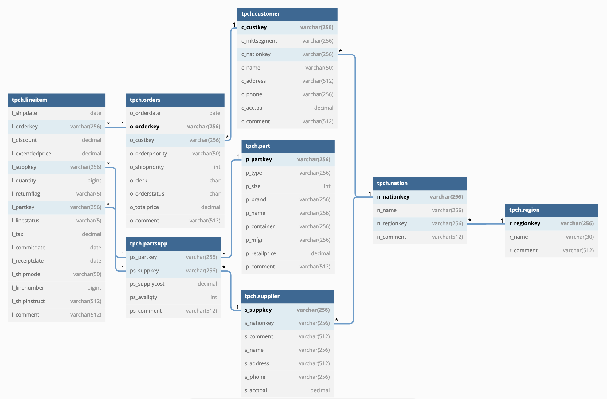

# Dore Tutorial

## [0] Introduction

Welcome to the Dore Tutorial!

At its heart, Dore is a *schema based fake data generation tool.*

This tutorial will teach you how to get started with Dore by getting hands on and guiding you (from scratch) to use Dore to generate data for a popular schema — the [TPC-H](https://relational.fit.cvut.cz/dataset/TPCH) schema on a MySQL database. By doing this, we will learn about some key terminology and concepts involved in working with Dore and how to apply them while creating your own Dore configs.

In the end, we will be running a few queries on the database, tables, and data that we created using Dore to ensure that data generation worked correctly.

# [1] Pre-Requisites

Before proceeding with this tutorial please ensure that:

- You have completed the steps for [Getting Started](https://www.notion.so/Dore-07747de465c146cbb9ee2395acbac940) with Dore.
- You have write access to a running MySQL instance.

# [2] About TPC-H

“The TPC-H is a decision support benchmark. It consists of a suite of business oriented ad-hoc queries and concurrent data modifications. The queries and the data populating the database have been chosen to have broad industry-wide relevance. The benchmark illustrates decision support systems that examine large volumes of data, execute queries with a high degree of complexity, and give answers to critical business questions”.

The above excerpt is taken from the official [TPC-H page](https://www.tpc.org/tpch/). 

In other words, the TPC-H is a suite of components that can be used for benchmarking databases. This suite includes:

- The `tpch` database structure
- The `tpch dbgen` utility which is used to populate the database with a specified amount of data (Scale Factor)
- The `tpch` benchmark queries, a set of pre-defined data warehouse queries to run against the database

For the purposes of this tutorial — as far as scope of Dore is concerned — we are primarily interested in the `tpch` database structure and we will be using **Dore** instead of `tpch dbgen` to populate the database with a specified amount of data. The benchmark queries are not relevant to Dore but you can use the queries to verify data generation.

The components of the TPC-H database consist of eight separate and individual tables. The relationship between columns of these tables are illustrated in the following figure:



Figure 1: TPC-H Schema

One thing to notice in this schema is that there are quite a few PK/FK dependencies amongst tables. For example, the `n_regionkey` column of the `tpch.nation` table is a foreign key which references the `r_regionkey` column of the `tpch.region` table. Generating fake data for schemas with such dependencies is one of the core problems that Dore solves well.

# [3] Using Dore to generate data for TPC-H schema

We will now try to use Dore to create the database, tables, and fill data into those tables based on the TPC-H schema in Figure 1.

## [3.1] Creating the Manifest

The first step towards using Dore is to create a **manifest**. The **manifest** is a config file(s) which is used by Dore. It describes in detail the requirements of the target database, the tables, and how data is to be generated. 

So let’s create an empty directory `dore-tutorial` in our `$HOME` directory and create an empty manifest file called `tpch-mysql-manifest.json` within the newly created directory. We will fill this file with required details over the course of this tutorial.

```bash
$ cd ~
$ mkdir dore-tutorial && cd dore-tutorial
$ touch tpch-mysql-manifest.json
```

Every manifest should have an `id` . Although Dore has does not use the `id` it has been kept as a required field within the manifest to improve readability of the manifest file — having an id in the file can help you identify your manifest from its content.

So create a JSON object (which is our manifest) and add the `id` field to your manifest as shown below:

```json
// file [$HOME/tpch-mysql-manifest.json]

{
    "id": "tpch-mysql-manifest"   // manifest id
}
```

Understanding the structure and concepts involved in the ***manifest*** is essential for using Dore. So let’s go over some of these concepts in the following paragraphs.

Looking at the TPC-H schema diagram in [Figure 1](https://www.notion.so/Tutorial-99590b654661448e96de05107bb065ac), we can identify the following things that need to be created in our target MySQL instance:

- A database to create tables in — let’s call this database `tpch`.
- Tables as per schema in [Figure 1](https://www.notion.so/Tutorial-99590b654661448e96de05107bb065ac).
- Data for the tables.

Any Dore manifest, on a high level, has information which specifies the above mentioned three pieces of information. These concepts are represented in Dore manifest using the structures mentioned below

### **[3.1.1] Datastores**

A datastore usually represents a particular database, whether that’s a database running within a locally installed MySQL server, a remote Elasticsearch cluster that is running on your company’s servers, or a remote MongoDB database hosted by a cloud provider.

For the this tutorial, we need to create a MySQL database named `tpch` which will hold all the tables mentioned in the schema in [Figure 1](https://www.notion.so/Tutorial-99590b654661448e96de05107bb065ac). 

To do this, add the following datastore configuration to the manifest. The explanation will follow.

```json
// file [$HOME/tpch-mysql-manifest.json]

{
  "id": "tpch-mysql-manifest", // manifest id
  "datastores": {         // Line 1 -- datastores root object
    "tpch-mysql": {         // Line 2 -- datastore id
      "protocol": "mysql",        // Line 3 -- datastore / database type
      "properties": {         // Line 4 -- database properties
        "database": "tpch_mysql_database",                  // Line 6
        "host": "<mysql-host>",           // Line 7
        "port": "<mysql-port>",           // Line 8
        "user": "<mysql-user>",           // Line 9
        "password": "<mysql-password>"    // Line 10
      }
    }
  }
}
```

All datastore configurations are added within the `datastores` object **[Line 1]** and each datastore object is identified by a unique id **[Line 2].** There can be multiple `datastore` objects within the `datastores` root object.

Each datastore object needs to specify the **protocol** of the system it’s representing **[Line 3].** In our case, the **protocol** is `mysql` as the datastore represents a MySQL database. ******

**Lines 6-10** represent MySQL specific properties for the datastore which Dore uses to connect and interact with the database. The structure of the `datastore.properties` object can potentially vary from one protocol to another so please refer to the relevant documentation on the manifest schema docs to know what fields to use within the `datastore.properties` object for each protocol type. Substitute actual values for your MySQL credentials here.

### **[3.1.2] Models and Attributes**

A **model** represents a set of structured data, called records. Models *usually* represent a table in SQL databases, collections in MongoDB, an index in Elasticsearch, etc.

Models consist of a set of **attributes**. Attributes *usually* correspond to columns of a table in SQL databases, fields of a collection in MongoDB, etc. Records correspond to rows or documents.

Taking the example of TPC-H schema in [Figure 1](https://www.notion.so/Tutorial-99590b654661448e96de05107bb065ac), each table in the schema will be represented by a model and columns of a table will be represented as the corresponding model’s attributes in the manifest.

Let’s add a `models` field in the manifest. All model definitions will be placed within the `models` field.

```json
// file [$HOME/tpch-mysql-manifest.json]

{
  "id": "tpch-mysql-manifest", // manifest id
  
  "datastores": {
    // Datastore definition. Please refer [Snippet 2](https://www.notion.so/Tutorial-99590b654661448e96de05107bb065ac) for what goes here //
  }
  
  "models": {
    // model definitions go here //
  },

}
```

We shall start simple and consider how we would go about defining the model requirements for the `region` table in Figure 1. The `region` table will be represented by a `region` model in the manifest.

We start with this model/table as it does not have dependencies on other models/tables in the schema (although other models are dependent on it).

In order to define the `region` table and generate fake data for it, we would need to specify:

1. Which database does the model belong to?
2. What is the model’s name and how should the corresponding table be represented in underlying database?
3. What are the model’s attributes and how should the corresponding columns be represented in the underlying database? What are the data types of the columns?
4. How should the value for the attributes be generated?
5. How much data / How many records should be generated for the model?

We shall learn how to provide answers to these questions for models in the manifest in the following sections.

Each model should have a unique ID and is defined by an object within the `models` field of the manifest with the key of the object as the model’s ID. 

Let’s add the `region` model to the manifest as shown below

```json
// file [$HOME/tpch-mysql-manifest.json]

{
  "id": "tpch-mysql-manifest", // manifest id

  "datastores": {
    // Datastore definition. Please refer [Snippet 2](https://www.notion.so/Tutorial-99590b654661448e96de05107bb065ac) for what goes here //
  },
  
  "models": {
    "region": { // Line 1: the region model
      
      // ... model definition ... //
      
    },
    // other models
  },
}
```

**Line 1** defines the root `region` model within the `models` object. Definition for the region model will provided within this object.

**[3.1.2.1] Which database does the model belong to?**

Each model *usually* exists within a database (with the exception of transient models or models that aren’t persisted). We indicate that it belongs to the MySQL database identified by the  `tpch-mysql` datastore (Defined in [Snippet 2](https://www.notion.so/Tutorial-99590b654661448e96de05107bb065ac)) in the manifest

```json
// file [$HOME/tpch-mysql-manifest.json]

{
  "id": "tpch-mysql-manifest", // manifest id
  
  "datastores": {
    // Datastore definition. Please refer [Snippet 2](https://www.notion.so/Tutorial-99590b654661448e96de05107bb065ac) for what goes here //
  },
  
  "models": {
    "region": {
      "datastore": "tpch-mysql"  // datastore for the region model
    }, 
    // other models
  }
}
```

**[3.1.2.2] What is the model’s name and how should the corresponding table be represented in underlying database?**

Next, we specify protocol / database specific properties (such as table name) for the model. These are specified within a `properties` field for the model:

```json
// file [$HOME/tpch-mysql-manifest.json]

{
  "id": "tpch-mysql-manifest", // manifest id
  
  "models": {
    "region": {
      "datastore": "tpch-mysql", 
      "properties": {               // model properties
        "tableName": "region"
      }
    }
  },

  "datastores": {
    // Datastore definition. Please refer Snippet 2 for what goes here //
  }
}
```

All protocol / database specific properties for the model are added within the `properties` field for the model object. These properties might be different for each database/protocol so please refer to the relevant protocol’s documentation for what fields go here.

**[3.1.2.3] What are the model’s attributes and how should the corresponding columns be represented in the underlying database? What are the data types of the columns?**

Model’s have attributes. In SQL databases, each table is represented by a model and the table’s columns are represented by the corresponding model’s attributes.

In NoSQL databases such as Elasticsearch, a model represents an Elasticsearch index and the model’s attributes represent the fields of that index.

A model’s attributes are defined within the `attributes` object of of a model. So let’s add this to our WIP manifest file:

```json
// file [$HOME/tpch-mysql-manifest.json]

{
  "id": "tpch-mysql-manifest", // manifest id
  
  "models": {
    "region": {
      "datastore": "tpch-mysql",    // datastore for the region model
      "properties": {
        "tableName": "region"
      }, 
      "attributes": {                // attributes root object
        // attributes go here
       }
    }
  },

  "datastores": {
    // Datastore definition. Please refer Snippet 2 for what goes here //
  }
}
```

Referring to the table structure of `region` in [Figure 1](https://www.notion.so/Tutorial-99590b654661448e96de05107bb065ac), we see that the `region` table has the following three columns:

1. `r_regionkey` 
2. `r_name`
3. `r_comment`

We shall be defining an `attribute` for each of the columns above within the `attributes` field we created in [Snippet 7](https://www.notion.so/Tutorial-99590b654661448e96de05107bb065ac). 

Like models, each attribute is uniquely defined by an ID which is the key for the attribute within the `attributes` object. 

Let’s add the above attributes to our region model’s `attributes`

```json
// file [$HOME/tpch-mysql-manifest.json]

{
  "id": "tpch-mysql-manifest", // manifest id
  
  "models": {
    "region": {
      "datastore": "tpch-mysql",    // datastore for the region model
      "properties": {
        "tableName": "region"
      }, 
      "attributes": {                // attributes root object
        "key": {}, 
        "name": {}, 
        "comment": {}
      }
    }
  },

  "datastores": {
    // Datastore definition. Please refer Snippet 2 for what goes here //
  }
}
```

Notice that the IDs are different from column names provided in the schema in [Figure 1](https://www.notion.so/Tutorial-99590b654661448e96de05107bb065ac). These IDs are independent of the column names as:

1. JSON/YAML might not support the syntax for attribute names supported by various protocols.
2. We might want to change the name used in the underlying storage. Doing this should not have to make us change references in the manifest (more on references later).

The same applies to models and datastores as well — the model ID or datastore ID is independent of any storage specific details.

Next, we specify the column names and data types for each of the attributes we created in [Snippet 8](https://www.notion.so/Tutorial-99590b654661448e96de05107bb065ac). 

Similar to the structure of a model or a datastore, protocol specific properties for attributes  (such as column name and data types in SQL databases) are defined within a `properties` object for each attribute.

```json
// file [$HOME/tpch-mysql-manifest.json]

{
  "id": "tpch-mysql-manifest", // manifest id
  "models": {
    "region": {
      "datastore": "tpch-mysql", // datastore for the region model
      "properties": {
        "tableName": "region"
      },
      "attributes": { // attributes root object
        "key": {
          "properties": {  // attribute properties for region.key attribute
            "columnName": "r_regionkey",
            "columnType": "varchar(256)"
          }
        },
        "name": {
          "properties": {  // attribute properties for region.name attribute
            "columnName": "r_name",
            "columnType": "varchar(30)"
          }
        },
        "comment": {
          "properties": {  // attribute properties for region.comment attribute
            "columnName": "r_comment",
            "columnType": "varchar(512)"
          }
        }
      }
    }
  },
  "datastores": {
    // Datastore definition. Please refer Snippet 2 for what goes here //
  }
}
```

**[3.1.2.4] How should the value for the attributes be generated?**

We will answer this question in some of the later sections of this tutorial.

**[3.1.2.5] How much data / How many records should be generated?**

For each model in our manifest, we need to specify the number of records that needs to be generated for the model. 

Let’s say we want to generate `5` records for the `region` model. We would define this in our manifest by using a `records` field as follows:

```json
// file [$HOME/tpch-mysql-manifest.json]

{
  "id": "tpch-mysql-manifest", // manifest id
  "models": {
    "region": {
      "records": 5
      "datastore": "tpch-mysql", // datastore for the region model
      "properties": {
        "tableName": "region"
      },
      "attributes": {
          // region attribute definitions //
      }
    }
  },
  "datastores": {
    // Datastore definition. Please refer Snippet 2 for what goes here //
  }
}
```

Please note that the actual count of records generated for a model is dependent on two values:

1. `records` value provided in the manifest
2. `--scale-factor` value provided while invoking Dore.

The actual count of records generated by Dore will be:

```jsx
records * scale_factor
```

For example, if `records` on a particular model was `10000` and we invoked Dore with a `--scale-factor` of `0.1`, then the actual count of records generated by Dore will be

```jsx
actual_records_count = 10000 * 0.1 = 1000
```

### [3.1.3] Attribute Value Generators

In this section, we learn how to answer the [question [**3.1.2.4**]](https://www.notion.so/Tutorial-99590b654661448e96de05107bb065ac) which we previously skipped.

Generating fake data for models translates to generating records for models which complies to the schema requirements. 

Each record for a model is a set of its attribute values. 

Thus, for generating fake data for models, we need to specify how each attribute’s value is to be generated.

The value config for each attribute can be provided using the `value` object within each attribute’s config in the manifest.

Let’s add a placeholder for `value` config for each attribute in the manifest:

```json
// file [$HOME/tpch-mysql-manifest.json]

{
  "id": "tpch-mysql-manifest", // manifest id
  "models": {
    "region": {
      "datastore": "tpch-mysql", // datastore for the region model
      "properties": {
        "tableName": "region"
      },
      "attributes": { // attributes root object
        "key": {
          "properties": {
            // region.key properties (See Snippet 9 for reference)
          },
          "value": { 
						// region.key attribute value config
          }
        },
        "name": {
          "properties": {
            // region.name properties (See Snippet 9 for reference)
          },
          "value": { 
						// region.name attribute value config
          }
        },
        "comment": {
          "properties": {
            // region.comment properties (See Snippet 9 for reference)
          },
          "value": { 
						// region.comment attribute value config
          }
        }
      }
    }
  },
  "datastores": {
    // Datastore definition. Please refer Snippet 2 for what goes here //
  }
}
```

Dore generates values for attributes based on the value config provided and it uses something called ***Attribute Value Generators*** to generate the values. There are various ***Attribute Value Generators*** supported by Dore — some which are based on popular libraries such as ***faker*** and others which are custom implementations such as ***selectors.*** There is also a class of attribute value generators ******such as ***ref*** which are used to generate values for dependent attributes — more on this later***.***

Each attribute value config usually follows the below general structure:

```json
"value": {
  "value-generator-id": {
     // params required by the value generator
  }
}
```

Let’s look at how the above general structure translates to actual configs in the manifest. We shall create value configs for each attribute of the `region` model one by one.

**Key**

The `region.key` is a unique identifier for the region and is of type `varchar` or `string`. We can use string UUIDs for this field and use the capabilities that **[faker** library provides to generate UUIDs.](https://faker.readthedocs.io/en/master/providers/faker.providers.misc.html?highlight=uuid#faker.providers.misc.Provider.uuid4) (See Dore’s manifest docs for more info on how to use Python’s `faker` library to generate values).

We thus define the `value` config for attribute `key` as follows:

```json
"value": {    // value config root object (at models.region.attributes.key)
  "faker": {    // use faker
    "uuid4": {}    // use faker's uuid4 method with no params
  }
}
```

**Name**

Let’s say we want `region.name` to be one of the following strings: `AFRICA`, `AMERICA`, `ASIA`, `EUROPE`, or `MIDDLE EAST` selected in a round robin fashion.

For this, we can use the `selector` value generator type and use the `roundRobin` selector that Dore provides. (See Dore’s manifest docs for more info on how to use the `selector` value generator)

```json
"value": {    // value config root object (at models.region.attributes.name)
  "selector": {    // use selector value generator
    "roundRobin": {    // use round robin selector
      "values": [        // list of values to select from
        "AFRICA", 
        "AMERICA",
        "ASIA",
        "EUROPE",
        "MIDDLE EAST"
      ]
    }
  }
}
```

**Comment**

The comment is a random sentence (or multiple sentences). We can use faker’s [sentence](https://faker.readthedocs.io/en/master/providers/faker.providers.lorem.html#faker.providers.lorem.Provider.sentence) method for this.

```json
"value": {
  "faker": {
    "sentence": {
      "nb_words": 20
    }
  }
}
```

## [3.2] Testing the manifest using Dore

By this point, we have created the manifest, defined the MySQL datastore, and defined the `region` model and its attributes. The complete manifest should look something like below:

```json
// file [$HOME/dore-tutorial/tpch-mysql-manifest.json]

{
  "id": "tpch-mysql-manifest",
  "models": {
    "region": {
      "records": 5,
      "datastore": "tpch-mysql",
      "properties": {
        "tableName": "region"
      },
      "attributes": {
        "key": {
          "properties": {
            "columnName": "r_regionkey",
            "columnType": "varchar(256)"
          },
          "value": {
            "faker": {
              "uuid4": {}
            }
          }
        },
        "name": {
          "properties": {
            "columnName": "r_name",
            "columnType": "varchar(30)"
          },
          "value": {
            "selector": {
              "roundRobin": {
                "values": [
                  "AFRICA",
                  "AMERICA",
                  "ASIA",
                  "EUROPE",
                  "MIDDLE EAST"
                ]
              }
            }
          }
        },
        "comment": {
          "properties": {
            "columnName": "r_comment",
            "columnType": "varchar(512)"
          },
          "value": {
            "faker": {
              "sentence": {
                "nb_words": 20
              }
            }
          }
        }
      }
    }
  },
  "datastores": {
    "tpch-mysql": {
      "type": "mysql",
      "properties": {
        "host": "<mysql-host>",           // use actual value here
        "port": "<mysql-port>",           // use actual value here
        "user": "<mysql-user>",           // use actual value here
        "password": "<mysql-password>"    // use actual value here
      }
    }
  }
}
```

Let’s give our manifest a trial run. We should be able to use this manifest and create the `region` table within the MySQL database and fill it with `5` rows of fake data as per our requirements using Dore.

In order to run Dore we first need to create and activate the virtual environment and install Dore’s dependencies (Create the virtual env and download the dependencies only if it wasn’t already done)

```bash
# cd into Dore's directory
cd /path/to/dore/   

# Create the virtual env. Do this only if it wasn't done before
python3 -m venv dore-venv

# Activate the virtual env. Do this only if it isn't already activated.
source dore-venv/bin/activate

# Download Dore's dependencies. Do this only if it wasn't done before
(dore-venv)$ python -m pip install -r requirements.txt
```

Once the virtual env is created, activated, and the dependencies are downloaded, you can invoke Dore and supply the manifest file as shown below:

```bash
(dore-venv)$ python dore --manfiest /abs/path/to/tpch-mysql-manifest.json
```

**Note**: Please provide absolute path to the manifest file in [Snippet 10](https://www.notion.so/Tutorial-99590b654661448e96de05107bb065ac).

If Dore executed successfully, you should see the following logs:

```bash
[2022-08-14 22:40:08,533] [INFO] [config.dore_config]: executing with seed [788240266]
[2022-08-14 22:40:08,534] [INFO] [cache.cache_factory]: using cache type [None]
[2022-08-14 22:40:08,615] [INFO] [manifest.manifest_factory]: successfully loaded manifest [tpch-mysql-manifest] located at [/.../tpch-test-region-only-mysql.json]
[2022-08-14 22:40:08,615] [INFO] [datastore.datastore_factory]: initializing datastore [tpch-mysql]
[2022-08-14 22:40:08,645] [INFO] [protocol.mysql.mysql_datastore_exists]: checking if database [tpch_mysql_database] exists
[2022-08-14 22:40:08,650] [INFO] [protocol.mysql.mysql_create_datastore]: creating database [tpch_mysql_database]
[2022-08-14 22:40:08,662] [INFO] [protocol.mysql.mysql_model_exists]: checking existence for table [`tpch_mysql_database`.`region`]
[2022-08-14 22:40:08,670] [INFO] [protocol.mysql.mysql_create_model]: creating table [`tpch_mysql_database`.`region`]
[2022-08-14 22:40:08,697] [INFO] [engine.engine]: generating records for model [region]
100% (10 of 10) |####################################################################################################################################################| Elapsed Time: 0:00:00 Time:  0:00:00
[2022-08-14 22:40:08,716] [INFO] [engine.engine]: [10] records generated for model [region]
[2022-08-14 22:40:08,717] [INFO] [engine.engine]: Clearing cache
```

You can check the database to see records that Dore created. 

Connect to the database configured in the Manifest datastore using your favorite MySQL client and execute the following:

```bash
mysql> use tpch_mysql_database

mysql> show tables;    # verify that Dore created the table
+-------------------------------+
| Tables_in_tpch_mysql_database |
+-------------------------------+
| region                        |
+-------------------------------+
1 row in set (0.00 sec)

mysql> desc region;    # verify that Dore created the region table as per the provided structure
+-------------+--------------+------+-----+---------+-------+
| Field       | Type         | Null | Key | Default | Extra |
+-------------+--------------+------+-----+---------+-------+
| r_regionkey | varchar(256) | YES  |     | NULL    |       |
| r_name      | varchar(30)  | YES  |     | NULL    |       |
| r_comment   | varchar(512) | YES  |     | NULL    |       |
+-------------+--------------+------+-----+---------+-------+
3 rows in set (0.01 sec)

mysql> select * from region;    # verify that Dore created the fake data for region table as per manifest.
+--------------------------------------+-------------+---------------------------------------------------------------------------------------------------------------------------------------------------------------------------------+
| r_regionkey                          | r_name      | r_comment                                                                                                                                                                       |
+--------------------------------------+-------------+---------------------------------------------------------------------------------------------------------------------------------------------------------------------------------+
| c0ec3f7e-075e-4c4c-825c-2c54f3d1800e | AFRICA      | Change some level deal road hair spend trip receive tonight week former reveal offer interesting conference part into growth doctor view staff morning what apply writer paper. |
| 9224cf6a-05b7-44af-ab8f-d981e04f928a | AMERICA     | Top thousand different interesting trade investment real protect data almost under level talk fact concern increase national according again environment office positive whose. |
| 86438105-60ff-4b7d-8225-ae00cf0d2538 | ASIA        | Leader year small water important relate participant future quite computer official home change far cup.                                                                        |
| e2b037bd-9d05-46fc-81c2-071adca418ec | EUROPE      | Feel case young herself financial history road happy point capital necessary operation smile see born address force feel agree camera guess color up clear teacher tree.        |
| df35a341-4475-4b57-a837-2cfe1f2a8449 | MIDDLE EAST | Check by study article several car table also artist home responsibility reality her star drug than politics room director high this history off mouth look politics.           |
+--------------------------------------+-------------+---------------------------------------------------------------------------------------------------------------------------------------------------------------------------------+
5 rows in set (0.00 sec)
```

If you were able to see the above in the MySQL database, Congratulations!! You were successfully able to execute Dore!

**Note**: The actual content of the rows might vary due to randomness involved in generating fake data, but you should be able to see similar data in your run as well.

## [3.3] Splitting the manifest into multiple files

We shall now complete our manifest with details for rest of the models. 

If we were to define all the models in the same manifest file (which we can), we can see how the manifest will soon become unreadable due to its size.

Dore allows us to split the manifest across multiple files and provide references to those files using the `ref` field in the manifest. Each model, datastore, and attribute definition can be stored in a different file. Typically, you would want to move each model and datastore to a separate file. You can choose to move attributes to separate files as well in case the model file itself starts getting large and unreadable.

Let’s head over back to the directory we created [earlier](https://www.notion.so/Tutorial-99590b654661448e96de05107bb065ac) and create a new file 

`tpch-mysql-datastore.json` which will hold the `tpch-mysql` datastore’s manifest config.

```bash
cd $HOME/dore-tutorial
touch tpch-mysql-datastore.json
```

We will now move everything within the `datastores.tpch-mysql` object in datastore config in Snippet 10 to this file:

```json
// $HOME/dore-tutorial/tpch-mysql-datastore.json

{
  "type": "mysql",
  "properties": {
    "host": "<mysql-host>",
    "port": "<mysql-port>",
    "user": "<mysql-user>",
    "password": "<mysql-password>"
  }
}
```

And provide a reference to this file in the manifest. 

```json
// $HOME/dore-tutorial/tpch-mysql-manifest.json

{
  "id": "tpch-mysql-manifest",
  "models": {
    "region": {
      // region model definition.
    }
  },
  "datastores": {
    "tpch-mysql": {
      "ref": "$HOME/dore-tutorial/tpch-mysql-datastore.json"
    }
  }
}
```

**Note: All file references in Dore should be [absolute paths](https://docs.oracle.com/javase/tutorial/essential/io/path.html#relative).**

Similarly, we shall create a new file to store the `region` model’s definition and move the definition to this file.

```bash
touch tpch-region-model.json
```

The contents of this file are going to be the manifest config we created for the `region` model in [Snippet 10](https://www.notion.so/Tutorial-99590b654661448e96de05107bb065ac)

```json
// $HOME/dore-tutorial/tpch-region-model.json

{
  "records": 5,
  "datastore": "tpch-mysql",
  "properties": {
    "tableName": "region"
  },
  "attributes": {
    "key": {
      "properties": {
        "columnName": "r_regionkey",
        "columnType": "varchar(256)"
      },
      "value": {
        "faker": {
          "uuid4": {}
        }
      }
    },
    "name": {
      "properties": {
        "columnName": "r_name",
        "columnType": "varchar(30)"
      },
      "value": {
        "selector": {
          "roundRobin": {
            "values": [
              "AFRICA",
              "AMERICA",
              "ASIA",
              "EUROPE",
              "MIDDLE EAST"
            ]
          }
        }
      }
    },
    "comment": {
      "properties": {
        "columnName": "r_comment",
        "columnType": "varchar(512)"
      },
      "value": {
        "faker": {
          "sentence": {
            "nb_words": 20
          }
        }
      }
    }
  }
}
```

And provide a reference to this file in the manifest

```json
// $HOME/dore-tutorial/tpch-mysql-manifest.json

{
  "id": "tpch-mysql-manifest",
  "models": {
    "region": {
      "ref": "$HOME/dore-tutorial/tpch-region-model.json"
    }
  },
  "datastores": {
    "tpch-mysql": {
      "ref": "$HOME/dore-tutorial/tpch-mysql-datastore.json"
    }
  }
}
```

Looks a lot cleaner than before, right?

## [3.4] Handling model conflicts

Let’s test our manifest by invoking Dore once again with the manifest using the steps shown [here](https://www.notion.so/Tutorial-99590b654661448e96de05107bb065ac)   to ensure everything is working fine after we split the manifest into multiple files

If you’re using the same database as you previously used and nothing changed in the MySQL end, you should see the following in Dore logs:

```bash
[2022-08-15 11:28:51,737] [INFO] [config.dore_config]: executing with seed [1977962928]
[2022-08-15 11:28:51,738] [INFO] [cache.cache_factory]: using cache type [None]
[2022-08-15 11:28:51,822] [INFO] [manifest.manifest_factory]: successfully loaded manifest [tpch-mysql-manifest] located at [/.../tpch-mysql-manifest.json]
[2022-08-15 11:28:51,822] [INFO] [datastore.datastore_factory]: initializing datastore [tpch-mysql]
[2022-08-15 11:28:51,853] [INFO] [protocol.mysql.mysql_datastore_exists]: checking if database [tpch_mysql_database] exists
[2022-08-15 11:28:51,862] [INFO] [protocol.mysql.mysql_model_exists]: checking existence for table [`tpch_mysql_database`.`region`]
Traceback (most recent call last):
  File "/usr/local/Cellar/python@3.9/3.9.12_1/Frameworks/Python.framework/Versions/3.9/lib/python3.9/runpy.py", line 197, in _run_module_as_main
    return _run_code(code, main_globals, None,
  File "/usr/local/Cellar/python@3.9/3.9.12_1/Frameworks/Python.framework/Versions/3.9/lib/python3.9/runpy.py", line 87, in _run_code
    exec(code, run_globals)
  File "/../../dore/dore/__main__.py", line 49, in <module>
    engine()
  File "/../../dore/dore/engine/engine.py", line 90, in engine
    config, context = bootstrap()
  File "/../../dore/dore/engine/bootstrap.py", line 35, in bootstrap
    initialize_models(config, context)
  File "/../../dore/dore/engine/initialize_models.py", line 46, in initialize_models
    raise ModelConflictException(model.config().id(), datastore.id())
exceptions.model_conflict_exception.ModelConflictException: conflicting model [region] found in datastore [tpch-mysql]
```

Dore throws a `ModelConflictException`. This indicates that the model that Dore is trying to create in the datastore — which is the `region` table in `tpch_mysql_database` — already exists in the database.

You can make Dore ignore this by providing the `--drop-conflicting-models` option while invoking Dore. **CAUTION:** Please note that using this flag allows Dore to drop/delete the conflicting model in the database and create a fresh one. Since this will result in to deletion of data in your databases, please be extremely careful while using this.

You can invoke Dore by providing this flag as follows:

```bash
python dore \
    --manfiest /abs/path/to/tpch-mysql-manifest.json \
    --drop-conflicting-models
```

You should have a successful Dore run now and be able to observe the below logs

```bash
[2022-08-15 11:36:36,187] [INFO] [config.dore_config]: executing with seed [-562314250]
[2022-08-15 11:36:36,187] [INFO] [cache.cache_factory]: using cache type [None]
[2022-08-15 11:36:36,275] [INFO] [manifest.manifest_factory]: successfully loaded manifest [tpch-mysql-manifest] located at [/.../tpch-mysql-manifest.json]
[2022-08-15 11:36:36,275] [INFO] [datastore.datastore_factory]: initializing datastore [tpch-mysql]
[2022-08-15 11:36:36,306] [INFO] [protocol.mysql.mysql_datastore_exists]: checking if database [tpch_mysql_database] exists
[2022-08-15 11:36:36,317] [INFO] [protocol.mysql.mysql_model_exists]: checking existence for table [`tpch_mysql_database`.`region`]
[2022-08-15 11:36:36,323] [INFO] [protocol.mysql.mysql_delete_model]: dropping table [`tpch_mysql_database`.`region`]
																																			^^^^^^^^^^^^^^^^^^^^^^^^^^^^^^^^^^^^^^^^^^^^^^^
[2022-08-15 11:36:36,368] [INFO] [protocol.mysql.mysql_create_model]: creating table [`tpch_mysql_database`.`region`]
[2022-08-15 11:36:36,408] [INFO] [engine.engine]: generating records for model [region]
100% (5 of 5) |###########################################################################################################################| Elapsed Time: 0:00:00 Time:  0:00:00
[2022-08-15 11:36:36,427] [INFO] [engine.engine]: [5] records generated for model [region]
[2022-08-15 11:36:36,427] [INFO] [engine.engine]: Clearing cache
```

We’ve highlighted an important log message to look out for in the snippet above which indicates which models were dropped during Dore’s execution.

## [3.5] Using variables in manifest

Let’s head over back to the `dore-tutorial` directory and take another look at the `tpch-mysql-datastore.json` file which holds our datastore config

```json
// $HOME/dore-tutorial/tpch-mysql-datastore.json

{
  "type": "mysql",
  "properties": {
	  "database": "
    "database": "tpch_mysql_database",
    "host": "<mysql-host>",           // use actual values here
    "port": "<mysql-port>",           // use actual values here
    "user": "<mysql-user>",           // use actual values here
    "password": "<mysql-password>"    // use actual values here
  }
}
```

We wouldn’t want to store database credentials in plaintext in the file due to security concerns. A better approach could perhaps be to use a variable as a placeholder in the manifest for the `user` and `password` fields above and provide those values while invoking Dore.

Dore supports specifying variables in the manifest using the [pystache](https://github.com/defunkt/pystache) library (which supports the [mustache](https://mustache.github.io/) syntax) and providing values to those variables while invoking Dore.

The mustache syntax for specifying variables is `{{variable_name}}`.

Let’s change the datastore file to use variables for username and password instead of the actual values as mentioned in the snippet above

```json
// $HOME/dore-tutorial/tpch-mysql-datastore.json

{
  "type": "mysql",
  "properties": {
    "database": "tpch_mysql_database",
    "host": "<mysql-host>",            // use actual values here
    "port": "<mysql-port>",            // use actual values here
    "user": "{{mysql-username}}",      // mustache variable -- provide value as cli arg
    "password": "{{mysql-password}}"   // mustache variable -- provide value as cli arg
  }
}
```

You can provide values for each variable by providing a cli arg with the following syntax

```json
python dore ... --varname1=value2 --varname2=value2 ...
```

while invoking Dore.

Let’s head over back to Dore’s directory and invoke Dore by providing values for the username and password variables and ensure we’re able to have a successful run with variables

```bash
python dore \
    --manfiest /abs/path/to/tpch-mysql-manifest.json \
    --drop-conflicting-models \
    --mysql-username=username \   # use your username
    --mysql-password=password     # use your password
```

You should be able to see a successful run again.

You can use variables in the way shown above anywhere in the manifest and provide values for it while invoking Dore. Dore will substitute values for those variables with the provided values during execution.

## [3.6] Representing dependencies

We shall now try to create manifest config for the `nation` model in TPC-H schema. 

Let’s create a new file called `tpch-nation-model.json` in the `dore-tutorial` directory for storing manifest config for the `nation` model:

```bash
cd $HOME/dore-tutorial
touch tpch-nation-model.json
```

And the `nation` model and the reference to the model’s config file in the manifest file:

```json
// $HOME/dore-tutorial/tpch-mysql-manifest.json

{
  "id": "tpch-mysql-manifest",
  "models": {
    "region": {
      "ref": "$HOME/dore-tutorial/tpch-region-model.json"
    },
    "nation": {
      "ref": "$HOME/dore-tutorial/tpch-nation-model.json"
    }
  },
  "datastores": {
    "tpch-mysql": {
      "ref": "$HOME/dore-tutorial/tpch-mysql-datastore.json"
    }
  }
}
```

And build the `nation` model’s config like we did for the `region` model incrementally.

Say that we want 25 rows in the `nation` table (where each row represents a nation). We can specify this by using the `records` field in model config:

```json
// $HOME/dore-tutorial/tpch-nation-model.json

{
  "records": 25
}
```

Next, we need to specify which datastore the model belongs to using the model’s `datastore` field. Since we want all models to be a part of the same datastore in this tutorial,, let’s mention the same in our manifest:

```json
// $HOME/dore-tutorial/tpch-nation-model.json

{
  "records": 25,
  "datastore": "tpch-mysql"
}
```

We also need to specify the name of the table for this model corresponds in the database. We do this by using the `properties` field of the model:

```json
// $HOME/dore-tutorial/tpch-nation-model.json

{
  "records": 25,
  "datastore": "tpch-mysql",
  "properties": {
    "tableName": "nation"
  }
}
```

Next, we need to define the model’s attributes and their properties by as per the schema in Figure 1. We can do this in a manner similar to how we created the `region` model’s attributes. The `nation` model with attribute configs might look something like below:

```json
// $HOME/dore-tutorial/tpch-nation-model.json

{
  "records": 25,
  "datastore": "tpch-mysql",
  "properties": {
    "tableName": "nation"
  },
  "attributes": {
    "key": {
      "properties": {
        "columnName": "n_nationkey",
        "columnType": "varchar(256)"
      },
      "value": {
        "faker": {
          "uuid4": {}
        }
      }
    },
    "name": {
      "properties": {
        "columnName": "n_name",
        "columnType": "varchar(256)"
      },
      "value": {
        "selector": {
          "roundRobin": {
            "values": [
              "ALGERIA",
              "ARGENTINA",
              "BRAZIL",
              "CANADA",
              "EGYPT",
              "ETHIOPIA",
              "FRANCE",
              "GERMANY",
              "INDIA",
              "INDONESIA"
            ]
          }
        }
      }
    },
    "regionKey": {
			"properties": {
        "columnName": "n_regionkey",
        "columnType": "varchar(256)"
      },
			"value": {
        // ?????????????? //
      }
    },
    "comment": {
      "properties": {
        "columnName": "n_comment",
        "columnType": "varchar(256)"
      },
      "value": {
        "faker": {
          "sentence": {
            "nb_words": 20
          }
        }
      }
    }
  }
}
```

The `nation.key` attribute is a primary key for the `nation` model. Thus, we use faker’s `uuid4` method to generate values for this attribute.

We indicate that the `name` property needs to be one of the mentioned names and should a picked in a round robin fashion.

Notice that we’ve left the `value` config for `regionKey` blank. This is because this attribute is a special case of a dependent attribute.

Each nation *belongs* to a region. We can see this dependency in the schema diagram in [Figure 1](https://www.notion.so/Tutorial-99590b654661448e96de05107bb065ac) where the `n_regionkey` column within the `nation` table is a foreign key and it references the `r_regionkey` column within the `region` table which is the primary key for the `region` table.

What this means is that each value within the `nation.n_regionkey` column should be one of the values that exist in `region.r_regionkey` column. In other words,  the `nation.n_regionkey` attribute’s value is dependent on `region.r_regionkey` attribute’s value.

We ask Dore to generate values for such attributes by specifying dependencies in the attribute’s `value` config and using `[ref` attribute value generator](https://www.notion.so/Ref-432e9075240548a098040839e7fc7ee5).

Since the `regionKey` attribute of `nation` model is dependent on `key` attribute of the `region` model, the `value` config for `nation.regionKey` would look like below:

```json
{
  "value": {
    "ref": "region.key"
  }
}
```

The complete model config for the `nation` model now looks like the snippet below:

```json
// $HOME/dore-tutorial/tpch-nation-model.json

{
  "records": 25,
  "datastore": "tpch-mysql",
  "properties": {
    "tableName": "nation"
  },
  "attributes": {
    "key": {
      "properties": {
        "columnName": "n_nationkey",
        "columnType": "varchar(256)"
      },
      "value": {
        "faker": {
          "uuid4": {}
        }
      }
    },
    "name": {
      "properties": {
        "columnName": "n_name",
        "columnType": "varchar(256)"
      },
      "value": {
        "selector": {
          "roundRobin": {
            "values": [
              "ALGERIA",
              "ARGENTINA",
              "BRAZIL",
              "CANADA",
              "EGYPT",
              "ETHIOPIA",
              "FRANCE",
              "GERMANY",
              "INDIA",
              "INDONESIA"
            ]
          }
        }
      }
    },
    "regionKey": {
      "properties": {
        "columnName": "n_regionkey",
        "columnType": "varchar(256)"
      },
      "value": {
        "ref": "region.key"              // dependent on another attribute
      }
    },
    "comment": {
      "properties": {
        "columnName": "n_comment",
        "columnType": "varchar(256)"
      },
      "value": {
        "faker": {
          "sentence": {
            "nb_words": 20
          }
        }
      }
    }
  }
}
```

### [3.6.1] Composite Attributes

Although we don’t have nested attributes in the SQL world, it is a common use-case in the NoSQL world. Nested attributes or embedded documents are typically used in the NoSQL databases to represent foreign key relations — instead of storing a key to a referenced model in a model as we would in relational databases, we store the document embed the document being referenced as a nested value within the parent document (which holds the reference). You can see how this is supported by [MongoDB](https://www.mongodb.com/docs/manual/tutorial/model-embedded-one-to-one-relationships-between-documents/) and [Elasticsearch](https://www.elastic.co/guide/en/elasticsearch/reference/current/nested.html).

In such cases, we say that an attribute is a composite of other attributes (from another model) and we can use the `composite` attribute value generator to generate values for such attributes.

Please refer [Composite](https://www.notion.so/Composite-0bdf25674a1c4b0c9cd3f3b8e6fff116) for detailed documentation on how to use this. Since this is not relevant to the tutorial at hand, we shall not consider this further.

## [3.7] Caching

In order to generate records for a schema in which attributes have dependencies on other models or attributes, the order in which we generate records for models is important. 

Dore first parses through the manifest, analyzes the attribute and model dependencies, and creates a topological order for iterating over the models for whom records are created based on the dependencies.

This is done so that before Dore starts generating records for a particular model, records for all other models on which the current model’s attributes have dependencies are already generated.

During generating records for a model, performing a database call to fetch a dependent model’s record during each record’s generation will have an extremely bad performance impact.

Dore uses a cache to avoid this performance impact. Once Dore generates records for a particular model, Dore checks if other models (for whom records are yet to be generated) have dependencies on the current model. If they do, Dore loads the current model’s generated records into the cache.

When Dore starts to generate records for the model which had a dependency on the previous model, records for the dependent model are read from cache instead of the database.

Dore is designed to be able to work with different types of caches — currently only `redis` and `local` are supported.

Please refer the caching section in README  [Caching](https://www.notion.so/Caching-2e311227dfd84dc99e5fbf9d33b6e547) for detailed documentation.

## [3.8] Manifest hierarchy

We learnt about a few structures that are a part of the manifest config. This section gives a high level summary of the hierarchy of elements within the manifest to get a feel of how the concepts we learnt so far fit together.

- `manifest` — the manifest root object. This is not present within a manifest.
    - `models` — container for all model configs in the manifest
        - The following structure applies for each model:
            - `properties` — database / protocol specific properties for the model
            - `attributes`
                - `value`
                - `properties` — database / protocol specific properties for the attribute
    - `datastores` — container for all datastore configs in the manfiest
        - `properties` — database / protocol specific properties for the datastore

Please refer ‣ for a more complete documentation of the manifest schema.

## [3.9] Completing the manifest

With the concepts we’ve learnt so far, we can define the model configs for all other models in the TPC-H schema. 

We’ve provided the definitions for each file of the TPC-H manifest below. We have mentioned the definitions for entities that we have discussed in this tutorial before again here so that you can refer this section and find definitions of all parts of the manifest in a single location.

`cd` into the tutorials directory and create the files below in case they aren’t already created.

### [3.9.1] region model

```json
// $HOME/dore-tutorial/tpch-region-model.json

{
  "records": 5,
  "datastore": "tpch-mysql",
  "properties": {
    "tableName": "region"
  },
  "attributes": {
    "key": {
      "properties": {
        "columnName": "r_regionkey",
        "columnType": "varchar(256)"
      },
      "value": {
        "faker": {
          "uuid4": {}
        }
      }
    },
    "name": {
      "properties": {
        "columnName": "r_name",
        "columnType": "varchar(30)"
      },
      "value": {
        "selector": {
          "roundRobin": {
            "values": [
              "AFRICA",
              "AMERICA",
              "ASIA",
              "EUROPE",
              "MIDDLE EAST"
            ]
          }
        }
      }
    },
    "comment": {
      "properties": {
        "columnName": "r_comment",
        "columnType": "varchar(512)"
      },
      "value": {
        "faker": {
          "sentence": {
            "nb_words": 20
          }
        }
      }
    }
  }
}
```

### [3.9.2] nation model

```json
// $HOME/dore-tutorial/tpch-region-model.json

{
  "records": 25,
  "datastore": "tpch-mysql",
  "properties": {
    "tableName": "nation"
  },
  "attributes": {
    "key": {
      "properties": {
        "columnName": "n_nationkey",
        "columnType": "varchar(256)"
      },
      "value": {
        "faker": {
          "uuid4": {}
        }
      }
    },
    "name": {
      "properties": {
        "columnName": "n_name",
        "columnType": "varchar(256)"
      },
      "value": {
        "selector": {
          "roundRobin": {
            "values": [
              "ALGERIA",
              "ARGENTINA",
              "BRAZIL",
              "CANADA",
              "EGYPT",
              "ETHIOPIA",
              "FRANCE",
              "GERMANY",
              "INDIA",
              "INDONESIA"
            ]
          }
        }
      }
    },
    "regionKey": {
      "properties": {
        "columnName": "n_regionkey",
        "columnType": "varchar(256)"
      },
      "value": {
        "ref": "region.key"
      }
    },
    "comment": {
      "properties": {
        "columnName": "n_comment",
        "columnType": "varchar(256)"
      },
      "value": {
        "faker": {
          "sentence": {
            "nb_words": 20
          }
        }
      }
    }
  }
}
```

### [3.9.3] customer model

```json
// $HOME/dore-tutorial/tpch-customer-model.json

{
  "records": 150000,
  "datastore": "tpch-mysql",
  "properties": {
    "tableName": "customer"
  },
  "attributes": {
    "key": {
      "properties": {
        "columnName": "c_custkey",
        "columnType": "varchar(256)"
      },
      "value": {
        "faker": {
          "uuid4": {}
        }
      }
    },
    "marketSegment": {
      "properties": {
        "columnName": "c_mktsegment",
        "columnType": "varchar(256)"
      },
      "value": {
        "selector": {
          "random": {
            "values": [
              "BUILDING",
              "MACHINERY",
              "FURNITURE",
              "AUTOMOBILE",
              "HOUSEHOLD"
            ]
          }
        }
      }
    },
    "name": {
      "properties": {
        "columnName": "c_name",
        "columnType": "varchar(256)"
      },
      "value": {
        "faker": {
          "name": {}
        }
      }
    },
    "nationKey": {
      "properties": {
        "columnName": "c_nationkey",
        "columnType": "varchar(256)"
      },
      "value": {
        "ref": "nation.key"
      }
    },
    "address": {
      "properties": {
        "columnName": "c_address",
        "columnType": "varchar(512)"
      },
      "value": {
        "faker": {
          "address": {}
        }
      }
    },
    "phone": {
      "properties": {
        "columnName": "c_phone",
        "columnType": "varchar(256)"
      },
      "value": {
        "faker": {
          "phone_number": {}
        }
      }
    },
    "accountBalance": {
      "properties": {
        "columnName": "c_acctbal",
        "columnType": "decimal(7,2)"
      },
      "value": {
        "faker": {
          "pyfloat": {
            "min_value": -1000,
            "max_value": 1000,
            "right_digits": 2
          }
        }
      }
    },
    "comment": {
      "properties": {
        "columnName": "c_comment",
        "columnType": "varchar(512)"
      },
      "value": {
        "faker": {
          "sentence": {
            "nb_words": 20
          }
        }
      }
    }
  }
}
```

### [3.9.4] part model

```json
// $HOME/dore-tutorial/tpch-part-model.json

{
  "records": 200000,
  "datastore": "tpch-mysql",
  "properties": {
    "tableName": "part"
  },
  "attributes": {
    "key": {
      "properties": {
        "columnName": "p_partkey",
        "columnType": "varchar(256)"
      },
      "value": {
        "faker": {
          "uuid4": {}
        }
      }
    },
    "type": {
      "properties": {
        "columnName": "p_type",
        "columnType": "varchar(256)"
      },
      "value": {
        "selector": {
          "random": {
            "values": [
              "LARGE PLATED TIN",
              "LARGE POLISHED STEEL",
              "STANDARD PLATED COPPER",
              "STANDARD BURNISHED BRASS",
              "ECONOMY BRUSHED BRASS",
              "STANDARD POLISHED BRASS",
              "PROMO POLISHED NICKEL",
              "STANDARD PLATED BRASS",
              "LARGE BRUSHED BRASS",
              "SMALL BRUSHED COPPER",
              "PROMO BRUSHED BRASS",
              "ECONOMY POLISHED STEEL",
              "SMALL BRUSHED TIN",
              "PROMO BURNISHED COPPER",
              "PROMO BRUSHED STEEL",
              "STANDARD ANODIZED STEEL",
              "MEDIUM ANODIZED BRASS",
              "STANDARD PLATED NICKEL",
              "SMALL POLISHED COPPER",
              "LARGE BURNISHED COPPER",
              "SMALL BURNISHED BRASS",
              "ECONOMY PLATED TIN",
              "PROMO BURNISHED TIN",
              "MEDIUM POLISHED TIN",
              "ECONOMY ANODIZED TIN",
              "MEDIUM PLATED NICKEL",
              "LARGE ANODIZED NICKEL",
              "MEDIUM BRUSHED NICKEL",
              "ECONOMY PLATED BRASS",
              "LARGE POLISHED COPPER",
              "STANDARD BRUSHED BRASS",
              "MEDIUM PLATED BRASS",
              "STANDARD ANODIZED TIN",
              "PROMO ANODIZED COPPER",
              "PROMO PLATED NICKEL",
              "PROMO ANODIZED NICKEL",
              "ECONOMY BRUSHED NICKEL",
              "SMALL POLISHED TIN",
              "MEDIUM BURNISHED NICKEL",
              "SMALL POLISHED NICKEL",
              "LARGE BRUSHED NICKEL",
              "LARGE POLISHED TIN",
              "PROMO POLISHED COPPER",
              "STANDARD PLATED TIN",
              "ECONOMY POLISHED TIN",
              "LARGE BRUSHED TIN",
              "MEDIUM ANODIZED COPPER",
              "STANDARD ANODIZED NICKEL",
              "STANDARD BRUSHED COPPER",
              "PROMO POLISHED STEEL",
              "LARGE ANODIZED COPPER",
              "STANDARD BRUSHED NICKEL",
              "MEDIUM POLISHED STEEL",
              "PROMO PLATED TIN",
              "STANDARD POLISHED NICKEL",
              "PROMO PLATED STEEL",
              "PROMO ANODIZED BRASS",
              "ECONOMY BURNISHED COPPER",
              "LARGE BURNISHED STEEL",
              "SMALL POLISHED STEEL",
              "ECONOMY ANODIZED NICKEL",
              "PROMO BRUSHED NICKEL",
              "MEDIUM PLATED COPPER",
              "ECONOMY BURNISHED TIN",
              "LARGE PLATED STEEL",
              "MEDIUM ANODIZED NICKEL",
              "STANDARD BRUSHED TIN",
              "PROMO BURNISHED BRASS",
              "PROMO POLISHED TIN",
              "ECONOMY POLISHED NICKEL",
              "MEDIUM POLISHED NICKEL",
              "MEDIUM POLISHED COPPER",
              "MEDIUM BRUSHED TIN",
              "STANDARD PLATED STEEL",
              "PROMO BRUSHED COPPER",
              "SMALL POLISHED BRASS",
              "MEDIUM PLATED TIN",
              "LARGE BURNISHED BRASS",
              "MEDIUM BURNISHED COPPER",
              "MEDIUM BRUSHED BRASS",
              "PROMO BURNISHED STEEL",
              "STANDARD POLISHED TIN",
              "STANDARD POLISHED STEEL",
              "LARGE ANODIZED BRASS",
              "STANDARD POLISHED COPPER",
              "SMALL BRUSHED NICKEL",
              "SMALL PLATED TIN",
              "ECONOMY PLATED COPPER",
              "LARGE POLISHED NICKEL",
              "PROMO BRUSHED TIN",
              "PROMO POLISHED BRASS",
              "MEDIUM ANODIZED STEEL",
              "STANDARD ANODIZED COPPER",
              "ECONOMY POLISHED BRASS",
              "LARGE BURNISHED TIN",
              "ECONOMY BRUSHED TIN",
              "LARGE PLATED BRASS",
              "ECONOMY ANODIZED STEEL",
              "SMALL BURNISHED COPPER",
              "ECONOMY ANODIZED COPPER",
              "ECONOMY BURNISHED NICKEL",
              "ECONOMY PLATED NICKEL",
              "STANDARD BURNISHED STEEL",
              "SMALL ANODIZED BRASS",
              "STANDARD BURNISHED NICKEL",
              "SMALL BRUSHED BRASS",
              "SMALL BRUSHED STEEL",
              "SMALL ANODIZED STEEL",
              "SMALL ANODIZED COPPER",
              "PROMO PLATED BRASS",
              "PROMO PLATED COPPER",
              "SMALL BURNISHED TIN",
              "ECONOMY BURNISHED BRASS",
              "MEDIUM PLATED STEEL",
              "STANDARD BRUSHED STEEL",
              "MEDIUM POLISHED BRASS",
              "SMALL PLATED BRASS",
              "LARGE ANODIZED TIN",
              "PROMO BURNISHED NICKEL",
              "SMALL PLATED COPPER",
              "MEDIUM BURNISHED STEEL",
              "MEDIUM BRUSHED COPPER",
              "LARGE BURNISHED NICKEL",
              "LARGE BRUSHED STEEL",
              "LARGE BRUSHED COPPER",
              "ECONOMY PLATED STEEL",
              "ECONOMY BRUSHED COPPER",
              "ECONOMY ANODIZED BRASS",
              "PROMO ANODIZED TIN",
              "LARGE ANODIZED STEEL",
              "SMALL BURNISHED STEEL",
              "LARGE PLATED COPPER",
              "LARGE PLATED NICKEL",
              "ECONOMY BRUSHED STEEL",
              "STANDARD ANODIZED BRASS",
              "MEDIUM BURNISHED TIN",
              "MEDIUM BRUSHED STEEL",
              "LARGE POLISHED BRASS",
              "SMALL ANODIZED TIN",
              "SMALL BURNISHED NICKEL",
              "ECONOMY BURNISHED STEEL",
              "SMALL ANODIZED NICKEL",
              "SMALL PLATED STEEL",
              "PROMO ANODIZED STEEL",
              "ECONOMY POLISHED COPPER",
              "STANDARD BURNISHED COPPER",
              "MEDIUM BURNISHED BRASS",
              "SMALL PLATED NICKEL",
              "MEDIUM ANODIZED TIN",
              "STANDARD BURNISHED TIN"
            ]
          }
        }
      }
    },
    "size": {
      "properties": {
        "columnName": "p_size",
        "columnType": "int"
      },
      "value": {
        "faker": {
          "pyint": {
            "min_value": 0,
            "max_value": 5
          }
        }
      }
    },
    "brand": {
      "properties": {
        "columnName": "p_brand",
        "columnType": "varchar(256)"
      },
      "value": {
        "selector": {
          "random": {
            "values": [
              "Brand#43",
              "Brand#55",
              "Brand#53",
              "Brand#13",
              "Brand#14",
              "Brand#33",
              "Brand#35",
              "Brand#51",
              "Brand#41",
              "Brand#32",
              "Brand#22",
              "Brand#23",
              "Brand#11",
              "Brand#52",
              "Brand#54",
              "Brand#42",
              "Brand#21",
              "Brand#12",
              "Brand#25",
              "Brand#44",
              "Brand#24",
              "Brand#34",
              "Brand#45",
              "Brand#31",
              "Brand#15"
            ]
          }
        }
      }
    },
    "name": {
      "properties": {
        "columnName": "p_name",
        "columnType": "varchar(256)"
      },
      "value": {
        "faker": {
          "name": {}
        }
      }
    },
    "container": {
      "properties": {
        "columnName": "p_container",
        "columnType": "varchar(256)"
      },
      "value": {
        "selector": {
          "random": {
             "values": [
            "LG BAG",
            "LG CASE",
            "WRAP CASE",
            "LG PKG",
            "MED PACK",
            "MED CASE",
            "LG CAN",
            "SM BOX",
            "WRAP BOX",
            "LG BOX",
            "JUMBO PACK",
            "WRAP DRUM",
            "JUMBO DRUM",
            "SM DRUM",
            "SM CAN",
            "MED BAG",
            "JUMBO BAG",
            "SM PKG",
            "MED PKG",
            "SM CASE",
            "JUMBO PKG",
            "MED CAN",
            "WRAP JAR",
            "JUMBO JAR",
            "SM BAG",
            "WRAP PACK",
            "LG PACK",
            "WRAP PKG",
            "SM PACK",
            "WRAP BAG",
            "MED BOX",
            "MED JAR",
            "LG JAR",
            "JUMBO BOX",
            "JUMBO CAN",
            "SM JAR",
            "MED DRUM",
            "LG DRUM",
            "WRAP CAN",
            "JUMBO CASE"
          ]
          }
        }
      }
    },
    "manufacturer": {
      "properties": {
        "columnName": "p_mfgr",
        "columnType": "varchar(256)"
      },
      "value": {
        "selector": {
          "random": {
            "values": [
              "Manufacturer#4",
              "Manufacturer#5",
              "Manufacturer#1",
              "Manufacturer#3",
              "Manufacturer#2"
            ]
          }
        }
      }
    },
    "retailPrice": {
      "properties": {
        "columnName": "p_retailprice",
        "columnType": "decimal(10,4)"
      },
      "value": {
        "faker": {
          "pyfloat": {
            "min_value": 100,
            "max_value": 1000,
            "right_digits": 2
          }
        }
      }
    },
    "comment": {
      "properties": {
        "columnName": "p_comment",
        "columnType": "varchar(512)"
      },
      "value": {
        "faker": {
          "sentence": {
            "nb_words": 20
          }
        }
      }
    }
  }
}
```

### [3.9.5] supplier model

```json
// $HOME/dore-tutorial/tpch-supplier-model.json

{
  "records": 10000,
  "datastore": "tpch-mysql",
  "properties": {
    "tableName": "supplier"
  },
  "attributes": {
    "key": {
      "properties": {
        "columnName": "s_suppkey",
        "columnType": "varchar(256)"
      },
      "value": {
        "faker": {
          "uuid4": {}
        }
      }
    },
    "nationKey": {
      "properties": {
        "columnName": "s_nationkey",
        "columnType": "varchar(256)"
      },
      "value": {
        "ref": "nation.key"
      }
    },
    "comment": {
      "properties": {
        "columnName": "s_comment",
        "columnType": "varchar(512)"
      },
      "value": {
        "faker": {
          "sentence": {
            "nb_words": 20
          }
        }
      }
    },
    "name": {
      "properties": {
        "columnName": "s_name",
        "columnType": "varchar(256)"
      },
      "value": {
        "faker": {
          "name": {}
        }
      }
    },
    "address": {
      "properties": {
        "columnName": "s_address",
        "columnType": "varchar(256)"
      },
      "value": {
        "faker": {
          "address": {}
        }
      }
    },
    "phone": {
      "properties": {
        "columnName": "s_phone",
        "columnType": "varchar(128)"
      },
      "value": {
        "faker": {
          "phone_number": {}
        }
      }
    },
    "accountBalance": {
      "properties": {
        "columnName": "s_acctbal",
        "columnType": "decimal(7,2)"
      },
      "value": {
        "faker": {
          "pyfloat": {
            "min_value": 100,
            "max_value": 1000
          }
        }
      }
    }
  }
}
```

### [3.9.6] orders model

```json
// $HOME/dore-tutorial/tpch-orders-model.json

{
  "records": 1500000,
  "datastore": "tpch-mysql",
  "properties": {
    "tableName": "orders"
  },
  "attributes": {
    "date": {
      "properties": {
        "columnName": "o_orderdate",
        "columnType": "date"
      },
      "value": {
        "faker": {
          "date_between": {
            "start_date": "-1M"
          }
        }
      }
    },
    "key": {
      "properties": {
        "columnName": "o_orderkey",
        "columnType": "varchar(256)"
      },
      "value": {
        "faker": {
          "uuid4": {}
        }
      }
    },
    "customerKey": {
      "properties": {
        "columnName": "o_custkey",
        "columnType": "varchar(256)"
      },
      "value": {
        "ref": "customer.key"
      }
    },
    "priority": {
      "properties": {
        "columnName": "o_orderpriority",
        "columnType": "varchar(256)"
      },
      "value": {
        "selector": {
          "random": {
            "values": [
              "4-NOT SPECIFIED",
              "1-URGENT",
              "5-LOW",
              "3-MEDIUM",
              "2-HIGH"
            ]
          }
        }
      }
    },
    "shippingPriority": {
      "properties": {
        "columnName": "o_shippriority",
        "columnType": "int"
      },
      "value": {
        "faker": {
          "pyint": {
            "min_value": 1,
            "max_value": 3
          }
        }
      }
    },
    "clerk": {
      "properties": {
        "columnName": "o_clerk",
        "columnType": "int"
      },
      "value": {
        "faker": {
          "pyint": {
            "min_value": 1,
            "max_value": 500
          }
        }
      }
    },
    "status": {
      "properties": {
        "columnName": "o_orderstatus",
        "columnType": "varchar(5)"
      },
      "value": {
        "selector": {
          "random": {
            "values": [
              "P",
              "O",
              "F"
            ]
          }
        }
      }
    },
    "totalPrice": {
      "properties": {
        "columnName": "o_totalprice",
        "columnType": "decimal(7, 2)"
      },
      "value": {
        "faker": {
          "pyfloat": {
            "min_value": 100,
            "max_value": 1000,
            "right_digits": 2
          }
        }
      }
    },
    "comment": {
      "properties": {
        "columnName": "o_comment",
        "columnType": "varchar(512)"
      },
      "value": {
        "faker": {
          "sentence": {
            "nb_words": 20
          }
        }
      }
    }
  }
}
```

### [3.9.7] partsupplier model

```json
// $HOME/dore-tutorial/tpch-partsupplier-model.json

{
  "records": 800000,
  "datastore": "tpch-mysql",
  "properties": {
    "tableName": "partsupp"
  },
  "attributes": {
    "partKey": {
      "properties": {
        "columnName": "ps_partkey",
        "columnType": "varchar(256)"
      },
      "value": {
        "ref": "part.key"
      }
    },
    "supplierKey": {
      "properties": {
        "columnName": "ps_suppkey",
        "columnType": "varchar(256)"
      },
      "value": {
        "ref": "supplier.key"
      }
    },
    "supplyCost": {
      "properties": {
        "columnName": "ps_supplycost",
        "columnType": "decimal(7, 3)"
      },
      "value": {
        "faker": {
          "pyfloat": {
            "min_value": 1,
            "max_value": 1000,
            "right_digits": 2
          }
        }
      }
    },
    "availableQuantity": {
      "properties": {
        "columnName": "ps_availqty",
        "columnType": "int"
      },
      "value": {
        "faker": {
          "pyint": {
            "min_value": 1,
            "max_value": 10000
          }
        }
      }
    },
    "comment": {
      "properties": {
        "columnName": "ps_comment",
        "columnType": "varchar(512)"
      },
      "value": {
        "faker": {
          "sentence": {
            "nb_words": 20
          }
        }
      }
    }
  }
}
```

### [3.9.8] lineitem model

```json
// $HOME/dore-tutorial/tpch-lineitem-model.json

{
  "records": 4423659,
  "datastore": "tpch-mysql",
  "properties": {
    "tableName": "lineitem"
  },
  "attributes": {
    "shippingDate": {
      "properties": {
        "columnName": "l_shipdate",
        "columnType": "date"
      },
      "value": {
        "faker": {
          "date_between": {
            "start_date": "-1y"
          }
        }
      }
    },
    "orderKey": {
      "properties": {
        "columnName": "l_orderkey",
        "columnType": "varchar(256)"
      },
      "value": {
        "ref": "orders.key"
      }
    },
    "discount": {
      "properties": {
        "columnName": "l_discount",
        "columnType": "decimal(3, 3)"
      },
      "value": {
        "faker": {
          "pyfloat": {
            "min_value": 0,
            "max_value": 0.3,
            "right_digits": 2
          }
        }
      }
    },
    "extendedPrice": {
      "properties": {
        "columnName": "l_extendedprice",
        "columnType": "decimal(7, 3)"
      },
      "value": {
        "faker": {
          "pyfloat": {
            "min_value": 100,
            "max_value": 10000,
            "right_digits": 2
          }
        }
      }
    },
    "supplierKey": {
      "properties": {
        "columnName": "l_suppkey",
        "columnType": "varchar(256)"
      },
      "value": {
        "ref": "partSupplier.supplierKey"
      }
    },
    "quantity": {
      "properties": {
        "columnName": "l_quantity",
        "columnType": "int"
      },
      "value": {
        "faker": {
          "pyint": {
            "min_value": 1,
            "max_value": 20
          }
        }
      }
    },
    "returnFlag": {
      "properties": {
        "columnName": "l_returnflag",
        "columnType": "varchar(5)"
      },
      "value": {
        "selector": {
          "random": {
            "values": [
              "N",
              "A",
              "R"
            ]   
          }
        }
      }
    },
    "partKey": {
      "properties": {
        "columnName": "l_partkey",
        "columnType": "varchar(256)"
      },
      "value": {
        "ref": "partSupplier.partKey"
      }
    },
    "lineStatus": {
      "properties": {
        "columnName": "l_linestatus",
        "columnType": "varchar(5)"
      },
      "value": {
        "ref": "orders.status"
      }
    },
    "tax": {
      "properties": {
        "columnName": "l_tax",
        "columnType": "decimal(3, 3)"
      },
      "value": {
        "faker": {
          "pyfloat": {
            "min_value": 0,
            "max_value": 0.5,
            "right_digits": 1
          }
        }
      }
    },
    "commitDate": {
      "properties": {
        "columnName": "l_commitdate",
        "columnType": "date"
      },
      "value": {
        "faker": {
          "date_between": {
            "start_date": "-1y"
          }
        }
      }
    },
    "receiptDate": {
      "properties": {
        "columnName": "l_receiptdate",
        "columnType": "date"
      },
      "value": {
        "faker": {
          "date_between": {
            "start_date": "-1y"
          }
        }
      }
    },
    "shippingMode": {
      "properties": {
        "columnName": "l_shipmode",
        "columnType": "varchar(256)"
      },
      "value": {
        "selector": {
          "random": {
            "values": [
              "RAIL",
              "TRUCK",
              "SHIP",
              "MAIL",
              "AIR",
              "FOB",
              "REG AIR"
            ]
          }
        }
      }
    },
    "lineNumber": {
      "properties": {
        "columnName": "l_linenumber",
        "columnType": "int"
      },
      "value": {
        "faker": {
          "pyint": {
            "min_value": 1,
            "max_value": 5
          }
        }
      }
    },
    "shippingInstructions": {
      "properties": {
        "columnName": "l_shipinstruct",
        "columnType": "varchar(512)"
      },
      "value": {
        "faker": {
          "sentence": {
            "nb_words": 20
          }
        }
      }
    },
    "comment": {
      "properties": {
        "columnName": "l_comment",
        "columnType": "varchar(512)"
      },
      "value": {
        "faker": {
          "sentence": {
            "nb_words": 20
          }
        }
      }
    }
  }
}
```

### [3.9.9] datastore

```json
// $HOME/dore-tutorial/tpch-mysql-datastore.json

{
  "type": "mysql",
  "properties": {
    "database": "tpch_mysql_database",
    "host": "<mysql-host>",            // use actual values here
    "port": "<mysql-port>",            // use actual values here
    "user": "{{mysql-username}}",      // variable -- provide value as cli arg
    "password": "{{mysql-password}}"   // variable -- provide value as cli arg
  }
}
```

### [3.9.10] manifest

```json
// $HOME/dore-tutorial/tpch-mysql-manifest.json

{
  "id": "tpch-mysql-manifest",
  "models": {
    "region": {
      "ref": "$HOME/dore-tutorial/tpch-region-model.json"
    },
    "nation": {
      "ref": "$HOME/dore-tutorial/tpch-nation-model.json"
    },
    "customer": {
      "ref": "$HOME/dore-tutorial/tpch-customer-model.json"
    },
    "part": {
      "ref": "$HOME/dore-tutorial/tpch-part-model.json"
    },
    "supplier": {
      "ref": "$HOME/dore-tutorial/tpch-supplier-model.json"
    },
    "orders": {
      "ref": "$HOME/dore-tutorial/tpch-orders-model.json"
    },
    "partsupplier": {
      "ref": "$HOME/dore-tutorial/tpch-partsupplier-model.json"
    },
    "lineitem": {
      "ref": "$HOME/dore-tutorial/tpch-lineitem-model.json"
    }
  },
  "datastores": {
    "tpch-mysql": {
      "ref": "$HOME/dore-tutorial/tpch-mysql-datastore.json"
    }
  }
}
```

## [3.10] Scale Factor

You might have noticed in some of the manifests that we have quite a high record count for some of the models. For example, the `lineitem` model has `4423659` specified as the record count.

At times, you might want to generate exactly these many records or a multiple of the mentioned `records` count on other times. Dore supports the capability to specify a *scale factor* arg while invocation — `--scale-factor` — which you can use to provide a multiple of the `records` count to be generated.

Thus, if the `--scale-factor` arg is provided with a value of `s`, The actual record count for a will be integer value of `records * s`. 

For example, if we provided `--scale-factor` as `0.1`, the target `records` count for 

- `lineitem` model will be integer value of `4423659 * 0.1` = `442365`
- `partsupplier` model will be integer value of `800000 * 0.1` = `80000`
- and so on…

## [3.11] Final Run

Now that we have completed the manifest, defined all the models and their attributes, and defined the required datastore, we shall now invoke Dore one final time with the following options:

- the manifest file we created `--manifest $HOME/dore-tutorial/tpch-mysql-manifest.json`
- scale factor of `0.01` — `--scale-factor 0.01`
- use `local` cache (Python Dictionary based) — `--cache local`
- drop and recreate conflicting models if any — `--drop-conflicting-models`
- provide database credentials as cli-args
    - username — `--mysql-username=your_username`
    - password — `--mysql-password=your_password`

Head over to the `dore` directory and invoke Dore using the following command:

```bash
python dore \
  --manifest $HOME/dore-tutorial/tpch-mysql-manifest.json \
  --scale-factor 0.01 \
  --cache local \
  --drop-conflicting-models \
  --mysql-username=your_username \
  --mysql-password=your_password
```

You sould be able to see Dore create all the models (by dropping and re-creating them if any conflicts were found) and generate records for all the models in the logs. The following snippet shows the log on my machine

```bash
[2022-08-16 10:02:32,174] [INFO] [config.dore_config]: executing with seed [-1107067796]
[2022-08-16 10:02:32,174] [INFO] [cache.cache_factory]: using cache type [local]
[2022-08-16 10:02:32,932] [INFO] [manifest.manifest_factory]: successfully loaded manifest [tpch-mysql-manifest] located at [/.../tpch-mysql-manifest.json]
[2022-08-16 10:02:32,932] [INFO] [datastore.datastore_factory]: initializing datastore [tpch-mysql]
[2022-08-16 10:02:32,968] [INFO] [protocol.mysql.mysql_datastore_exists]: checking if database [tpch_mysql_database] exists
[2022-08-16 10:02:32,974] [INFO] [protocol.mysql.mysql_model_exists]: checking existence for table [`tpch_mysql_database`.`region`]
[2022-08-16 10:02:32,979] [INFO] [protocol.mysql.mysql_delete_model]: dropping table [`tpch_mysql_database`.`region`]
[2022-08-16 10:02:32,999] [INFO] [protocol.mysql.mysql_create_model]: creating table [`tpch_mysql_database`.`region`]
[2022-08-16 10:02:33,024] [INFO] [protocol.mysql.mysql_model_exists]: checking existence for table [`tpch_mysql_database`.`nation`]
[2022-08-16 10:02:33,029] [INFO] [protocol.mysql.mysql_delete_model]: dropping table [`tpch_mysql_database`.`nation`]
[2022-08-16 10:02:33,044] [INFO] [protocol.mysql.mysql_create_model]: creating table [`tpch_mysql_database`.`nation`]
[2022-08-16 10:02:33,071] [INFO] [protocol.mysql.mysql_model_exists]: checking existence for table [`tpch_mysql_database`.`customer`]
[2022-08-16 10:02:33,077] [INFO] [protocol.mysql.mysql_delete_model]: dropping table [`tpch_mysql_database`.`customer`]
[2022-08-16 10:02:33,093] [INFO] [protocol.mysql.mysql_create_model]: creating table [`tpch_mysql_database`.`customer`]
[2022-08-16 10:02:33,130] [INFO] [protocol.mysql.mysql_model_exists]: checking existence for table [`tpch_mysql_database`.`part`]
[2022-08-16 10:02:33,135] [INFO] [protocol.mysql.mysql_delete_model]: dropping table [`tpch_mysql_database`.`part`]
[2022-08-16 10:02:33,154] [INFO] [protocol.mysql.mysql_create_model]: creating table [`tpch_mysql_database`.`part`]
[2022-08-16 10:02:33,193] [INFO] [protocol.mysql.mysql_model_exists]: checking existence for table [`tpch_mysql_database`.`supplier`]
[2022-08-16 10:02:33,198] [INFO] [protocol.mysql.mysql_delete_model]: dropping table [`tpch_mysql_database`.`supplier`]
[2022-08-16 10:02:33,217] [INFO] [protocol.mysql.mysql_create_model]: creating table [`tpch_mysql_database`.`supplier`]
[2022-08-16 10:02:33,257] [INFO] [protocol.mysql.mysql_model_exists]: checking existence for table [`tpch_mysql_database`.`orders`]
[2022-08-16 10:02:33,263] [INFO] [protocol.mysql.mysql_delete_model]: dropping table [`tpch_mysql_database`.`orders`]
[2022-08-16 10:02:33,287] [INFO] [protocol.mysql.mysql_create_model]: creating table [`tpch_mysql_database`.`orders`]
[2022-08-16 10:02:33,329] [INFO] [protocol.mysql.mysql_model_exists]: checking existence for table [`tpch_mysql_database`.`partsupp`]
[2022-08-16 10:02:33,334] [INFO] [protocol.mysql.mysql_delete_model]: dropping table [`tpch_mysql_database`.`partsupp`]
[2022-08-16 10:02:33,355] [INFO] [protocol.mysql.mysql_create_model]: creating table [`tpch_mysql_database`.`partsupp`]
[2022-08-16 10:02:33,385] [INFO] [protocol.mysql.mysql_model_exists]: checking existence for table [`tpch_mysql_database`.`lineitem`]
[2022-08-16 10:02:33,391] [INFO] [protocol.mysql.mysql_delete_model]: dropping table [`tpch_mysql_database`.`lineitem`]
[2022-08-16 10:02:33,422] [INFO] [protocol.mysql.mysql_create_model]: creating table [`tpch_mysql_database`.`lineitem`]
[2022-08-16 10:02:33,473] [INFO] [engine.engine]: generating records for model [region]
100% (5 of 5) |######################################################################################################################################################| Elapsed Time: 0:00:00 Time:  0:00:00
[2022-08-16 10:02:33,489] [INFO] [engine.engine]: [5] records generated for model [region]
[2022-08-16 10:02:33,489] [INFO] [engine.engine]: populating cache with records for [region]
[2022-08-16 10:02:33,501] [INFO] [engine.engine]: generating records for model [nation]
100% (25 of 25) |####################################################################################################################################################| Elapsed Time: 0:00:00 Time:  0:00:00
[2022-08-16 10:02:33,523] [INFO] [engine.engine]: [25] records generated for model [nation]
[2022-08-16 10:02:33,523] [INFO] [engine.engine]: populating cache with records for [nation]
[2022-08-16 10:02:33,539] [INFO] [engine.engine]: generating records for model [customer]
100% (1500 of 1500) |################################################################################################################################################| Elapsed Time: 0:00:00 Time:  0:00:00
[2022-08-16 10:02:34,166] [INFO] [engine.engine]: [1500] records generated for model [customer]
[2022-08-16 10:02:34,166] [INFO] [engine.engine]: populating cache with records for [customer]
[2022-08-16 10:02:34,199] [INFO] [engine.engine]: generating records for model [part]
100% (2000 of 2000) |################################################################################################################################################| Elapsed Time: 0:00:00 Time:  0:00:00
[2022-08-16 10:02:34,755] [INFO] [engine.engine]: [2000] records generated for model [part]
[2022-08-16 10:02:34,755] [INFO] [engine.engine]: populating cache with records for [part]
[2022-08-16 10:02:34,793] [INFO] [engine.engine]: generating records for model [supplier]
100% (100 of 100) |##################################################################################################################################################| Elapsed Time: 0:00:00 Time:  0:00:00
[2022-08-16 10:02:34,875] [INFO] [engine.engine]: [100] records generated for model [supplier]
[2022-08-16 10:02:34,875] [INFO] [engine.engine]: populating cache with records for [supplier]
[2022-08-16 10:02:34,893] [INFO] [engine.engine]: generating records for model [orders]
100% (15000 of 15000) |##############################################################################################################################################| Elapsed Time: 0:00:02 Time:  0:00:02
[2022-08-16 10:02:37,143] [INFO] [engine.engine]: [15000] records generated for model [orders]
[2022-08-16 10:02:37,143] [INFO] [engine.engine]: populating cache with records for [orders]
[2022-08-16 10:02:37,345] [INFO] [engine.engine]: generating records for model [partsupplier]
100% (8000 of 8000) |################################################################################################################################################| Elapsed Time: 0:00:00 Time:  0:00:00
[2022-08-16 10:02:37,988] [INFO] [engine.engine]: [8000] records generated for model [partsupplier]
[2022-08-16 10:02:37,988] [INFO] [engine.engine]: populating cache with records for [partsupplier]
[2022-08-16 10:02:38,106] [INFO] [engine.engine]: generating records for model [lineitem]
100% (44236 of 44236) |##############################################################################################################################################| Elapsed Time: 0:00:13 Time:  0:00:13
[2022-08-16 10:02:51,484] [INFO] [engine.engine]: [44236] records generated for model [lineitem]
[2022-08-16 10:02:51,484] [INFO] [engine.engine]: Clearing cache
```

# [4] Testing

Let’s verify that Dore created tables for all the models in our manifest:

```bash
mysql> use tpch_mysql_database;
mysql> show tables;

+-------------------------------+
| Tables_in_tpch_mysql_database |
+-------------------------------+
| customer                      |
| lineitem                      |
| nation                        |
| orders                        |
| part                          |
| partsupp                      |
| region                        |
| supplier                      |
+-------------------------------+
8 rows in set (0.00 sec)
```

Now that we have generated data for the TPC-H schema, let’s head over to our MySQL let’s run a few queries involving JOINs to ensure we were able to successfully generate data with the model / attribute dependencies.

The queries given below might be a bit complex, but you don’t need to worry too much about what the query is doing apart from noticing the fact that we perform JOINs across multiple tables on the PK/FK relationships. Running the query below should ideally result in a non-empty result set indicating that the JOINed sets were non-empty.

```sql
SELECT
    supplier.s_acctbal,
    supplier.s_name,
    nation.n_name,
    part.p_partkey,
    part.p_mfgr,
    supplier.s_address,
    supplier.s_phone,
    supplier.s_comment,
    partsupp.ps_supplycost
FROM
    supplier
    JOIN partsupp
        ON supplier.s_suppkey = partsupp.ps_suppkey
    JOIN part
        ON part.p_partkey = partsupp.ps_partkey
    JOIN nation
        ON supplier.s_nationkey = nation.n_nationkey
    JOIN region
        ON nation.n_regionkey = region.r_regionkey
WHERE
  region.r_name = 'EUROPE'
  AND part.p_size = 4
  AND part.p_type LIKE '%BRASS'
  AND partsupp.ps_supplycost = (
    SELECT 
      min(ps_supplycost)
    FROM
      partsupp
      JOIN supplier
        ON s_suppkey = ps_suppkey
      JOIN nation
        ON s_nationkey = n_nationkey
      JOIN region
        ON n_regionkey = r_regionkey
    WHERE
      region.r_name = 'EUROPE'
      AND part.p_partkey = ps_partkey
  );
```

Another example that JOINs across a different set of tables:

```sql
SELECT
  l_orderkey,
  SUM(l_extendedprice * (1 - l_discount)) AS revenue,
  o_orderdate,
  o_shippriority
FROM
  customer,
  orders,
  lineitem
WHERE
  c_mktsegment = 'BUILDING'
  AND c_custkey = o_custkey
  AND l_orderkey = o_orderkey
  AND o_orderdate > (NOW() - INTERVAL 120 DAY)
  AND l_shipdate > (NOW() - INTERVAL 60 DAY)
GROUP BY
  l_orderkey,
  o_orderdate,
  o_shippriority
ORDER BY
  revenue DESC,
  o_orderdate
LIMIT 10;
```

This should also result in a non-empty set.

# [5] Conclusion

We have learned quite a bit today:

- What is Dore.
- What is the TPC-H database.
- Schema of the TPC-H database.
- How to use Dore to generate fake data for the TPC-H schema.
    - How to define the manifest
    - Structure of the manifest.
        - What are datastores, models, and attributes.
        - Defining the criteria for generating values for an attribute.
    - How Dore uses caching and how you can use a different cache.
    - How to define variables in the manifest and provide values for these variables using CLI-args.
- Testing the fake data generated by Dore by running a few queries which perform JOINs across tables.